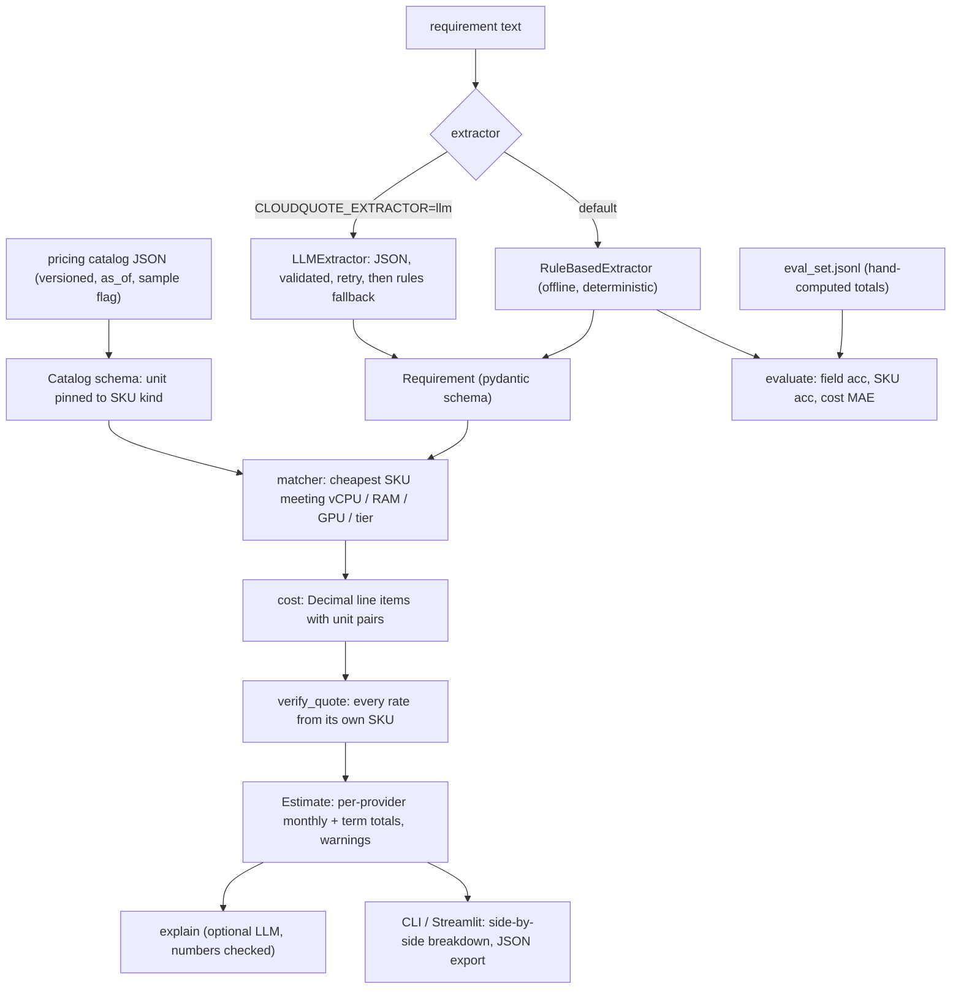

# cloudquote

Describe the infrastructure you need in plain English and get the matching AWS and GCP instances and storage classes, with a real monthly cost and a line-by-line breakdown in correct units.

[](https://github.com/KrishnaAnnavaram/cloudquote/actions/workflows/ci.yml)

> **Prices are a sample.** The bundled catalog (`sample-2026.10.1`) holds illustrative on-demand prices written for this demo. Check them against the official AWS and Google Cloud pricing pages before relying on any number.

## Features

- **Structured extraction.** The text becomes a `Requirement` validated by pydantic: vCPUs, RAM, GPUs, instance count, hours per month, storage size, access pattern, retrieval, egress, term and providers. A malformed spec gives a clear validation error, never a crash.
- **The LLM never picks SKUs.** An optional LLM extractor (OpenAI-compatible or Gemini) only fills in the schema. Its output is validated, and if it fails it gets one retry with the error before falling back to the deterministic rule-based parser. Model ids are configuration.
- **Deterministic matching.** The matcher picks the cheapest catalog SKU that meets every constraint. It never adds GPUs you didn't ask for, uses burstable families only for bursty workloads, and maps the access pattern to a storage class.
- **Real cost arithmetic.** Compute is hours/month × USD/hour × instances. Storage is GB × USD/GB-month. Retrieval and egress are GB/month × USD/GB, with free tiers. All of it uses `Decimal`, with rounding to cents only for display.
- **No mixed SKUs.** Each line item names exactly one SKU, and its rate is read from that SKU. `verify_quote` re-checks every line against the catalog (provider, kind, rate and unit).
- **A versioned, validated catalog.** It records `catalog_version`, `as_of`, the region per provider and an `is_sample` flag with a required disclaimer. The billing unit is fixed by SKU kind, so a storage price can't be per hour.
- **Billing rules.** Minimum storage durations (e.g. a 90-day minimum on cold tiers) are charged and flagged. Parts that can't be priced are reported, never guessed.
- **Explanations that can't contradict the numbers.** The deterministic summary is always available. An optional LLM rewrite is accepted only if every dollar figure in it appears in the computed quote.
- **Evaluation harness.** It measures field-level extraction accuracy, SKU accuracy and monthly-cost error against hand-computed totals.

## Architecture



## Quickstart

```bash
python -m venv .venv && . .venv/Scripts/activate     # Windows; use .venv/bin/activate on Linux/macOS
pip install -e ".[dev,ui]"
cp .env.example .env                                # optional: leave empty for offline mode
cloudquote quote "2 instances with 4 vCPUs and 16 GiB RAM each, 24/7, plus 2 TB of hot storage and 500 GB egress per month, for 12 months"
cloudquote quote --json --spec my_requirement.json  # skip extraction, price a JSON spec
cloudquote catalog                                  # show the catalog and its disclaimer
cloudquote eval                                     # extraction / SKU / cost accuracy
cloudquote ui                                       # Streamlit app
```

Example output (sample prices):

```
== AWS (us-east-1) ==
  compute   2 x m5.xlarge (4 vCPU, 16 GiB) x 730 h/month
            1460 hours/month x 0.192 USD/hour = $280.32/month; x 12.00 months = $3,363.84
  storage   S3 Standard: 2048 GB stored
            2048 GB x 0.023 USD/GB-month = $47.10/month; x 12.00 months = $565.25
  egress    Data transfer out to internet: 500 GB/month (first 100 GB/month free)
            400 GB/month x 0.09 USD/GB = $36.00/month; x 12.00 months = $432.00
  monthly total: $363.42
== GCP (us-central1) ==   monthly total: $296.60   -> cheapest complete quote: GCP
```

## Configuration

| Variable | Default | Purpose |
|---|---|---|
| `CLOUDQUOTE_CATALOG` | bundled sample | Path to a pricing catalog JSON with the same schema |
| `CLOUDQUOTE_EXTRACTOR` | `rules` | `rules` (offline) or `llm` |
| `CLOUDQUOTE_LLM_PROVIDER` | `none` | `openai` (any OpenAI-compatible server) or `gemini` |
| `CLOUDQUOTE_LLM_MODEL` | `gpt-4.1-mini` / `gemini-2.5-flash` | Model id, any base model |
| `CLOUDQUOTE_LLM_BASE_URL` | provider default | e.g. `http://localhost:11434/v1` for Ollama |
| `CLOUDQUOTE_EXPLAIN_WITH_LLM` | `false` | Rewrite the summary with the LLM (numbers are checked) |
| `OPENAI_API_KEY` | - | Hosted OpenAI endpoint |
| `GEMINI_API_KEY` | - | Gemini |

## Project structure

```
src/cloudquote/
  units.py          billing conventions: 730 h/month, 1 TB = 1024 GB, Decimal money
  spec.py           Requirement / ComputeSpec / StorageSpec (pydantic, extra fields forbidden)
  catalog.py        versioned catalog schema, SKU kinds with pinned units, loader
  matcher.py        cheapest SKU meeting constraints, storage tier mapping
  cost.py           LineItem unit pairs, Quote, Estimate, verify_quote
  extract.py        RuleBasedExtractor and LLMExtractor (validate, retry, fall back)
  llm.py            LLM interface, OpenAI-compatible and Gemini adapters, ScriptedLLM fake
  explain.py        deterministic summary and number-checked LLM rewrite
  evaluate.py       field / SKU / cost evaluation
  service.py        QuoteService used by the CLI and UI
  config.py         settings from environment variables
  cli.py            `cloudquote` command
  app/streamlit_app.py  text -> editable spec -> side-by-side quotes
  data/sample_catalog.json  SAMPLE prices (us-east-1, us-central1)
  data/eval_set.jsonl       labelled requirements with hand-computed totals
tests/              pytest suite: cost arithmetic and units, catalog, matcher, extraction, CLI
```

## How it works

1. **Extract.** The rule-based parser reads vCPUs, RAM (`GiB RAM` / `memory`), GPUs, instance count, running hours (`per day/week/month`, `24/7`, business hours), sizes (RAM vs. storage vs. egress vs. retrieval, by context), access pattern, term and provider restrictions. Every default it fills in is listed as an assumption.
2. **Validate.** The result must pass the `Requirement` schema, e.g. at most 730 h/month and at least 1 vCPU, with no unknown fields. LLM output goes through the same model.
3. **Match.** For each provider, the matcher filters the catalog by vCPU, RAM and GPU minimums and workload class, then takes the cheapest SKU. Storage maps frequent, infrequent, rare and archive to Standard, IA/Nearline, Glacier IR/Coldline and Deep Archive/Archive.
4. **Price.** It builds line items with explicit unit pairs, and `LineItem` refuses any other combination. The monthly total is the sum of quantity × rate. The term total multiplies by the term, and storage is billed for at least its minimum duration.
5. **Verify and explain.** `verify_quote` re-reads every rate from the catalog by `sku_id`. The summary then names the chosen SKUs, both totals, the cheapest complete quote and the sample-price disclaimer.

## Testing

```bash
pytest -q
```

The 52 offline tests cover:
- hand-computed arithmetic for compute (hours × rate × count), storage (GB × GB-month rate), egress free tiers, retrieval, term totals, minimum-duration charges and Decimal exactness
- rejection of mismatched units, and detection of a rate taken from a different or foreign SKU
- catalog validation (a per-hour storage price, duplicates, a missing disclaimer or region, negative prices)
- matcher rules, extraction and unit conversions, LLM retry and fallback, number-checked explanations, the evaluation harness and the CLI

`cloudquote eval` on the bundled set (17 items) gives:
- **14 core items:** 100% field and SKU accuracy and a $0.00 cost error. The parser was written alongside these phrasings, so they show the pipeline is wired correctly, not how well it generalises.
- **3 deliberately hard phrasings** ("four servers with eight cores", "half a terabyte", "weekdays 9 to 5"): the rule parser misses these, which brings overall SKU accuracy to 0.915. They are the case for the LLM extractor.

## Roadmap

- [x] **M1:** versioned pricing catalog schema + cost calculator with unit-checked line items and tests
- [x] **M2:** validated structured extraction (rules + LLM with retry/fallback) and a constraint matcher
- [x] **M3:** evaluation harness (field accuracy, SKU accuracy, cost error against hand-computed totals)
- [x] **M4:** CLI and Streamlit UI with side-by-side breakdowns, an editable spec and JSON export
- [ ] **M5:** fetchers for the AWS Price List API and GCP Cloud Billing Catalog API that write dated catalogs
- [ ] **M6:** more regions, reserved/committed-use and spot pricing, block storage and request charges
- [ ] **M7:** Azure, and a larger held-out eval set written independently of the parser

## Limitations

- **Prices are a hand-authored sample** for one region per provider. Verify them before use, and plug in a real catalog with `CLOUDQUOTE_CATALOG`.
- The model covers on-demand Linux compute, object storage, retrieval and internet egress only. It leaves out OS licences, block volumes, request fees, tiered volume discounts, support plans and taxes.
- Unit conventions are a 730-hour month and 1 TB = 1024 GB. Real invoices prorate by the second or hour.
- The rule-based parser only handles numeric phrasing. Word numbers and loose wording need the LLM extractor.
- The eval set is small and authored by the same person as the parser.

## License

MIT © 2026 Krishna Annavaram. See [LICENSE](LICENSE).
