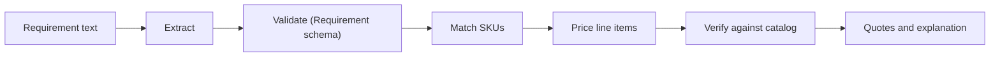
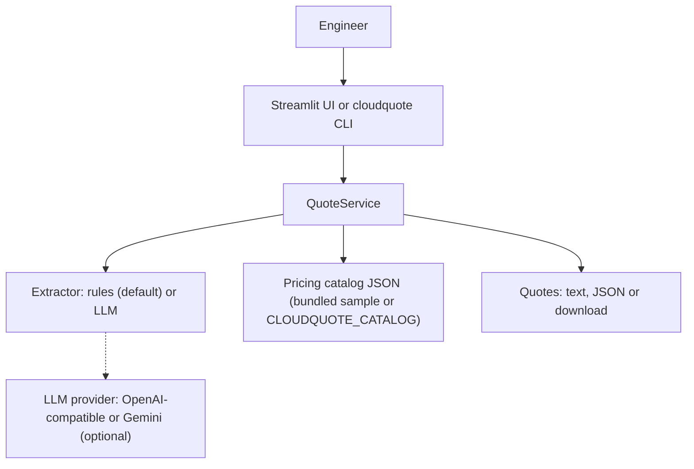
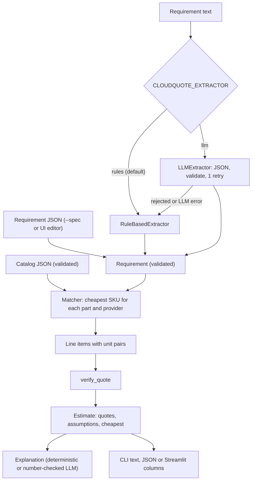

<div align="center">

# cloudquote — Plain-English Requirements to Priced AWS and GCP Quotes

**cloudquote is a cost estimator for engineers who describe infrastructure in plain English. It takes a requirement text through these steps to a side-by-side AWS and GCP quote:**

`extract` → `validate` → `match SKUs` → `price with units` → `verify` → `explain`.


**[Summary](#1-summary)** ·
**[Workflow](#4-the-end-to-end-workflow)** ·
**[Run it](#17-how-to-run-cloudquote)** ·
**[Configuration](#174-environment-variables)** ·
**[Known problems](#20-known-problems)** ·
**[Glossary](#22-glossary)**

</div>

> [!NOTE]
> This README uses ASD-STE100 Simplified Technical English. The writing rules and the project
> vocabulary are in [`docs/ste-style-guide.md`](docs/ste-style-guide.md). Each term in the
> [Glossary](#22-glossary) has only one meaning.

---

> [!WARNING]
> Do not use the bundled prices for a real budget. The catalog `sample-2026.10.1` contains illustrative prices that the author wrote for this demo.
> Compare each price with the official AWS and Google Cloud pricing pages, or load your own catalog with `CLOUDQUOTE_CATALOG`.

cloudquote changes a plain-English infrastructure requirement into a validated, structured requirement.
A deterministic matcher then selects the cheapest catalog SKU that meets each constraint, and a calculator prices each line with explicit units.
The LLM is optional. It never selects a SKU and never calculates a price.
All money is `Decimal`, and the code rounds to cents only for display.

This README is the **one location that explains all of cloudquote**. It gives these topics:

- the general design
- each component and its procedure, step by step
- the cost rules
- the data map
- the runbook
- the validation results and the known problems

| If you are… | Read |
|---|---|
| A manager or reviewer | [1](#1-summary), [3](#3-design-rules), [4](#4-the-end-to-end-workflow), [19](#19-validation-results), [21](#21-key-points) |
| A developer who joins the project | All sections, in sequence. Keep [17](#17-how-to-run-cloudquote) and [20](#20-known-problems) open while you work |
| An operator who runs cloudquote | [17](#17-how-to-run-cloudquote), then the section for the component that you use |

---

## Table of contents

1. 🧭 [Summary](#1-summary)
2. 🏗️ [How cloudquote is built](#2-how-cloudquote-is-built)
   - 2.1 [Components](#21-components)
   - 2.2 [System context](#22-system-context)
   - 2.3 [Repository layout](#23-repository-layout)
3. 🛡️ [Design rules](#3-design-rules)
4. 🔄 [The end-to-end workflow](#4-the-end-to-end-workflow)
   - 4.1 [Full flow](#41-full-flow)
   - 4.2 [The life cycle of one quote](#42-the-life-cycle-of-one-quote)
5. 📏 [The billing units](#5-the-billing-units)
6. 🔵 [The requirement schema](#6-the-requirement-schema)
7. 🟢 [The rule-based extractor](#7-the-rule-based-extractor)
8. 🟣 [The LLM extractor](#8-the-llm-extractor)
9. 📒 [The pricing catalog](#9-the-pricing-catalog)
10. 🎯 [The SKU matcher](#10-the-sku-matcher)
11. 🧮 [The cost calculator](#11-the-cost-calculator)
12. 💬 [Explanations](#12-explanations)
13. 🖥️ [Service, CLI and user interface](#13-service-cli-and-user-interface)
14. 🧪 [The evaluation harness](#14-the-evaluation-harness)
15. ⚖️ [The cost model](#15-the-cost-model)
16. 🗂️ [Data and file map](#16-data-and-file-map)
17. ▶️ [How to run cloudquote](#17-how-to-run-cloudquote)
    - 17.1 [Prerequisites](#171-prerequisites) · 17.2 [Installation](#172-installation) · 17.3 [Run cloudquote](#173-run-cloudquote) · 17.4 [Environment variables](#174-environment-variables)
18. 🧩 [How to extend cloudquote](#18-how-to-extend-cloudquote)
19. ✅ [Validation results](#19-validation-results)
20. ⚠️ [Known problems](#20-known-problems)
21. 📌 [Key points](#21-key-points)
22. 📖 [Glossary](#22-glossary)
23. 📄 [License](#23-license)

---

## 1. Summary

**The problem.** A person describes the infrastructure that they need, and they want a correct monthly cost from two clouds. These questions are difficult:

- Which numbers in the text are vCPUs, RAM, storage, egress or running hours?
- Which instance type and storage class meet the requirement at the lowest price?
- How do you prevent a mix of units, for example a storage price shown as an hourly rate?
- How do you prevent a price that belongs to a different SKU?
- How do you prevent an LLM explanation that changes the numbers?

cloudquote gives each of these questions its own component. Each component has a validated input and a validated output.

| Item | Value |
|---|---|
| Input | A plain-English requirement, or a `Requirement` JSON file |
| Output | One quote for each provider: line items, monthly total, term total, warnings, parts that are not priced, and the cheapest complete quote |
| Components | **13** modules plus the package data: units, spec, catalog, matcher, cost, extract, llm, explain, evaluate, service, config, cli, Streamlit UI |
| Providers | AWS (`us-east-1`) and GCP (`us-central1`) in the sample catalog |
| LLM | Optional: any OpenAI-compatible server or Gemini, for extraction and for the explanation text |
| Offline mode | The `RuleBasedExtractor` and the deterministic explanation. No key and no network |
| Safety | Unit pairs are fixed for each line category. `verify_quote` checks each rate against its own SKU |
| Tests | **54** unit tests (`pytest`) |



---

## 2. How cloudquote is built

### 2.1 Components

| Component | Module | Purpose |
|---|---|---|
| Billing units | `src/cloudquote/units.py` | 730 h/month, 1 TB = 1024 GB, `Decimal` money, conversions |
| Requirement schema | `src/cloudquote/spec.py` | `Requirement`, `ComputeSpec`, `StorageSpec` (pydantic, extra fields forbidden) |
| Pricing catalog | `src/cloudquote/catalog.py` | Versioned catalog schema. The SKU kind fixes the billing unit |
| SKU matcher | `src/cloudquote/matcher.py` | Cheapest SKU that meets each constraint. Storage tier for each access pattern |
| Cost calculator | `src/cloudquote/cost.py` | `LineItem`, `Quote`, `Estimate`, `verify_quote` |
| Extractors | `src/cloudquote/extract.py` | `RuleBasedExtractor` and `LLMExtractor` with retry and fallback |
| LLM adapters | `src/cloudquote/llm.py` | `LLM` interface, OpenAI-compatible and Gemini adapters, `ScriptedLLM` for tests |
| Explanations | `src/cloudquote/explain.py` | Deterministic summary and an LLM text with a number check |
| Evaluation | `src/cloudquote/evaluate.py` | Field accuracy, SKU accuracy and cost error |
| Service | `src/cloudquote/service.py` | `QuoteService`, the one entry point for the CLI and the UI |
| Settings | `src/cloudquote/config.py` | Environment variables and a local `.env` loader |
| CLI | `src/cloudquote/cli.py` | The `cloudquote` command with 4 subcommands |
| Streamlit UI | `src/cloudquote/app/streamlit_app.py` | Text, editable spec, side-by-side quotes, JSON download |
| Package data | `src/cloudquote/data/` | `sample_catalog.json` and `eval_set.jsonl` |

### 2.2 System context



### 2.3 Repository layout

```
cloudquote/
├── .github/workflows/ci.yml     # CI: Python 3.11, pip install -e ".[dev]", pytest -q
├── .env.example                 # every environment variable, all values empty
├── pyproject.toml               # package, extras (ui, dev), cloudquote script, pydantic>=2.5
├── src/cloudquote/
│   ├── units.py  spec.py              # billing conventions and the requirement schema
│   ├── catalog.py  matcher.py         # catalog schema and SKU selection
│   ├── cost.py                        # line items, quotes, verify_quote
│   ├── extract.py  llm.py             # rule-based and LLM extraction, LLM adapters
│   ├── explain.py  evaluate.py        # explanations and the evaluation harness
│   ├── service.py  config.py  cli.py  # entry point, settings, command line
│   ├── app/streamlit_app.py           # user interface
│   └── data/
│       ├── sample_catalog.json        # 40 SKUs with SAMPLE prices
│       └── eval_set.jsonl             # 17 labelled requirements (14 core, 3 hard)
└── tests/                             # 54 tests, no network, no API keys
```

---

## 3. Design rules

### 3.1 The LLM never selects a SKU
The LLM only fills the `Requirement` schema. The matcher selects SKUs from the catalog with fixed rules. Thus each recommendation is a real catalog entry that meets the requested vCPUs, RAM and GPUs.

### 3.2 Each requirement passes one schema
The rule-based extractor, the LLM extractor and a JSON file all produce a `Requirement`. Pydantic validates each field range and forbids unknown fields. A bad requirement gives a validation error with a clear message, not a crash in the cost code.

### 3.3 Each line has a fixed unit pair
`LineItem` accepts only three unit pairs: `hours/month × USD/hour`, `GB × USD/GB-month` and `GB/month × USD/GB`. Any other pair raises `UnitMismatch`. The catalog schema also fixes the unit of each SKU kind, so a storage price can never be hourly.

### 3.4 Each rate comes from the SKU that the line names
Each line names exactly one SKU and reads its rate from that SKU. `verify_quote` runs after each quote. It checks the provider, the kind, the rate and the unit of each line against the catalog.

### 3.5 Money is exact
The code calculates with `decimal.Decimal`. `D()` converts a number through `str`, so `0.1` stays `0.1`. The code rounds to cents (`ROUND_HALF_UP`) only for display and for JSON output.

### 3.6 No value is guessed in silence
Each default that the rule-based extractor uses goes into the assumptions list. A part that has no matching SKU goes into `unavailable`, and the quote is not complete. A minimum storage duration is charged and gives a warning.

### 3.7 The explanation cannot change the numbers
The deterministic explanation is always available. An LLM text is accepted only if each dollar amount in it is an amount of the computed quote.

---

## 4. The end-to-end workflow

### 4.1 Full flow



### 4.2 The life cycle of one quote

1. The user gives a text, a text on standard input, or a JSON spec file.
2. The extractor changes the text into a `Requirement`, plus a list of assumptions.
3. Pydantic validates the `Requirement`. An invalid requirement stops the procedure with `error:`.
4. For each provider in `providers`, the matcher selects a compute SKU, a storage SKU and an egress SKU.
5. The calculator makes one line for each priced part, with a fixed unit pair.
6. `verify_quote` checks each line against the catalog.
7. The `Estimate` selects the cheapest complete quote by monthly total.
8. The CLI or the UI shows the lines, the totals, the warnings and the explanation.

---

## 5. The billing units

**Purpose.** Keep one set of billing conventions for all calculations.

| Constant | Value | Use |
|---|---|---|
| `HOURS_PER_MONTH` | 730 (8,760 / 12) | Monthly hours of an always-on instance |
| `HOURS_PER_DAY`, `HOURS_PER_WEEK` | 24, 168 | Conversion of daily and weekly hours |
| `DAYS_PER_MONTH` | 730 / 24 = 30.4167 | Conversion of days to months |
| `GB_PER_TB` | 1024 | 1 TB = 1024 GB. TiB is the same billing unit |
| `GB_PER_PB` | 1024 × 1024 | Petabytes |
| `CENT` | 0.01 | Display rounding |

**Rules**

- `to_gb` accepts `MB`, `MiB`, `GB`, `GiB`, `TB`, `TiB`, `PB` and `PiB`. Another unit raises `ValueError`.
- `hours_per_month` refuses more than 24 h/day, 168 h/week or 730 h/month.
- `months_from` accepts days, weeks, months and years. One year is 12 months.
- `fmt_money` shows USD as `$1,234.56`.

---

## 6. The requirement schema

**Purpose.** Give one validated structure for each estimate.

| Model | Field | Rule |
|---|---|---|
| `ComputeSpec` | `vcpus` | 1 to 448, minimum vCPUs for each instance |
| | `memory_gib` | More than 0, at most 12,288 |
| | `gpus` | 0 to 16 (default 0) |
| | `count` | 1 to 1,000 identical instances (default 1) |
| | `hours_per_month` | More than 0, at most 730 (default 730), for each instance |
| | `workload` | `general` (default), `compute`, `memory` or `burstable` |
| `StorageSpec` | `size_gb` | More than 0 |
| | `access` | `frequent` (default), `infrequent`, `rare` or `archive` |
| | `retrieval_gb_per_month` | 0 or more (default 0) |
| `Requirement` | `compute`, `storage` | Optional parts |
| | `egress_gb_per_month` | 0 or more (default 0) |
| | `term_months` | More than 0, at most 120 (default 1) |
| | `providers` | One or more of `aws` and `gcp`, no repeats (default both) |

**Rules**

- Each model forbids extra fields and is frozen.
- A requirement with no compute, no storage and no egress is invalid.
- `llm_json_schema()` gives the JSON schema of `Requirement` to the LLM extractor.

---

## 7. The rule-based extractor

**Purpose.** Change a requirement text into a `Requirement` with regular expressions, offline and deterministic.

| Input | Output |
|---|---|
| A plain-English text | An `Extraction`: the `Requirement`, the method `rules` and the assumptions |

**Procedure**

1. Normalise the white space. An empty text raises `ExtractionError`.
2. Find the vCPUs (`4 vCPUs`, `8 cores`) and the RAM (`16 GiB RAM`, `memory of 32 GB`). Keep the highest value.
3. Find the GPU count. If the text names GPUs, CUDA or deep learning with no count, use 1 GPU and record an assumption.
4. If there is compute and no vCPU count, use 1 vCPU (4 with a GPU). Record an assumption.
5. If there is compute and no RAM, use 4 GiB for each vCPU. Record an assumption.
6. Find the running hours (`N hours per day/week/month`, `24/7`, `business hours` = 40 h/week).
7. If no hours are given, use 730 h/month. Record an assumption, unless the text says `24/7` or `always on`.
8. Find the instance count (`3 servers`, `2 instances`, `4 nodes`).
9. Find the workload class from key words. `sustained`, `steady`, `predictable` or `production` change `burstable` to `general`.
10. Find each size and give it a role from the near words: RAM, egress, retrieval or storage.
11. Use the first storage size. Add all egress sizes and all retrieval sizes.
12. Find the access pattern from key words (`archive`, `compliance`, `cold`, `backups`, `occasional` and others).
13. Find the term (`for 12 months`, `retained for 365 days`). If none, use 1 month and record an assumption.
14. Find a provider restriction (`AWS only`, `only GCP`).
15. Build the `Requirement`. A validation error becomes an `ExtractionError`.

**Rules**

- A comma before exactly three digits is a thousands separator (`1,000 GB` = 1,000 GB). Another comma is a decimal comma (`1,5 TB` = 1.5 TB).
- Impossible hours (for example 200 hours per week) raise `ExtractionError`.
- The extractor reads only digits. Word numbers (`four servers`) are not found.

---

## 8. The LLM extractor

**Purpose.** Use an LLM for free wording, with the same schema and a safe fallback.

| Input | Output |
|---|---|
| A requirement text and an `LLM` | An `Extraction` with the method `llm:<model name>`, or the rule-based result with a rejection note |

**Procedure**

1. Send the JSON schema of `Requirement` and the text, with the system prompt `EXTRACT_SYSTEM`.
2. Remove a code fence, if there is one, and validate the reply with `Requirement.model_validate_json`.
3. If the reply is invalid, add the first validation error to the prompt and try one more time.
4. If the LLM call fails (`LLMError`), stop the retries at once.
5. After the failures, use `RuleBasedExtractor`. Put the note `LLM extraction rejected (...)` first in the assumptions.

**Rules**

- `EXTRACT_SYSTEM` tells the model not to recommend instance types or prices, and gives the unit conventions.
- `OpenAICompatibleLLM` asks for `response_format = json_object` at temperature 0. The default model is `gpt-4.1-mini`.
- `GeminiLLM` asks for `application/json` at temperature 0. The default model is `gemini-2.5-flash`.
- `OPENAI_API_KEY` is necessary only when the host is `api.openai.com`. A local server needs no key.
- The HTTP timeout is 60 seconds. An HTTP or JSON error raises `LLMError`.

---

## 9. The pricing catalog

**Purpose.** Hold the prices in one versioned file that the code validates at load time.

| Input | Output |
|---|---|
| A catalog JSON file (`CLOUDQUOTE_CATALOG` or the bundled sample) | A frozen `Catalog` with typed SKUs |

| SKU kind | Fixed unit | Extra fields |
|---|---|---|
| `compute` | `hour` | `family`, `vcpus`, `memory_gib`, `gpus`, `gpu_model`, `burstable` |
| `storage` | `GB-month` | `access_tier`, `min_storage_days`, `retrieval_per_gb` |
| `egress` | `GB` | `free_gb_per_month` |

**Rules**

- The catalog records `catalog_version`, `as_of`, `currency` (only `USD`), `is_sample`, `disclaimer`, `regions` and `skus`.
- Each `sku_id` must start with `<provider>:`. Each price must be 0 or more.
- Two SKUs with the same `sku_id` make the catalog invalid.
- Each provider of a SKU must have a region in `regions`.
- If `is_sample` is true, the disclaimer must contain the word `sample`.
- The bundled catalog has 40 SKUs: 16 AWS compute, 14 GCP compute, 8 storage classes and 2 egress prices.

---

## 10. The SKU matcher

**Purpose.** Select, for each provider, the cheapest SKU that meets each constraint.

| Input | Output |
|---|---|
| The catalog, a provider and a `ComputeSpec` or `StorageSpec` | One `ComputeSku` or `StorageSku`, or `NoMatchingSku` |

**Procedure**

1. Keep each compute SKU with at least the requested vCPUs, RAM and GPUs.
2. If the requirement has no GPU, remove each GPU SKU.
3. If the workload is not `burstable`, remove each burstable SKU (`t3`, `e2-micro`, `e2-small`, `e2-medium`).
4. Sort by price, then vCPUs, RAM and `sku_id`. Select the first SKU.
5. For storage, keep the classes whose `access_tier` is the requested access pattern. Select the cheapest.
6. For egress, `Catalog.egress` selects the cheapest egress SKU of the provider.

| Access pattern | AWS | GCP |
|---|---|---|
| `frequent` | S3 Standard | Cloud Storage Standard |
| `infrequent` | S3 Standard-IA | Cloud Storage Nearline |
| `rare` | S3 Glacier Instant Retrieval | Cloud Storage Coldline |
| `archive` | S3 Glacier Deep Archive | Cloud Storage Archive |

**Rules**

- The workloads `general`, `compute` and `memory` remove burstable SKUs. No workload prefers a family.
- If no SKU meets the constraints, the part goes into `unavailable` with the reason.

---

## 11. The cost calculator

**Purpose.** Price each part with a fixed unit pair, and prove that each rate belongs to its SKU.

| Input | Output |
|---|---|
| The catalog and a `Requirement` | An `Estimate` with one `Quote` for each provider |

**Procedure**

1. Compute line: quantity = `hours_per_month × count` (hours/month), rate = SKU price (USD/hour).
2. Storage line: quantity = `size_gb` (GB), rate = SKU price (USD/GB-month).
3. If the term is shorter than the minimum storage duration, bill the minimum and add a warning.
4. Retrieval line: if retrieval is more than 0 and the class has a retrieval price, quantity = GB/month, rate = `retrieval_per_gb`.
5. Egress line: quantity = `max(egress − free_gb_per_month, 0)` (GB/month), rate = egress price (USD/GB).
6. Monthly cost of a line = quantity × rate. Term cost of a line = monthly cost × billed months.
7. `verify_quote` checks each line. A mismatch raises `ValueError`.
8. `Estimate.cheapest` selects the complete quote with the lowest monthly total. Equal totals sort by provider name.

**Rules**

- A quote with an `unavailable` part is not complete. It cannot be the cheapest quote.
- Billed months for storage = `max(term_months, min_storage_days / 30.4167)`.
- JSON output rounds the money to cents but shows each rate exactly.

---

## 12. Explanations

**Purpose.** Give a short text summary that cannot contradict the computed numbers.

| Input | Output |
|---|---|
| An `Estimate` and an optional `LLM` | A text, and a flag that tells if the LLM text was used |

**Procedure**

1. `explain` writes one line for each provider: the SKUs, the monthly total and the term total.
2. It adds the cheapest complete quote and the sample disclaimer.
3. If `CLOUDQUOTE_EXPLAIN_WITH_LLM` is true and an LLM is configured, `explain_with_llm` asks for a rewrite in at most 5 sentences.
4. `numbers_consistent` finds each `$` amount in the LLM text.
5. If an amount is not a total, a line cost or a rate of the quote, the LLM text is discarded.
6. If the LLM fails or gives an empty text, the deterministic text is used.

**Rules**

- The allowed amounts are the monthly and term totals, the monthly and term cost of each line, and each rate.
- Only amounts with a `$` sign are checked.

---

## 13. Service, CLI and user interface

**Purpose.** Give one entry point and two front ends.

| Command | What it does |
|---|---|
| `cloudquote quote TEXT...` | Extract, price and print the quote with the explanation |
| `cloudquote quote` (text on standard input) | The same, with the text from standard input |
| `cloudquote quote --spec FILE` | Skip extraction. Price a `Requirement` JSON file |
| `cloudquote quote --json ...` | Print the `Estimate` as JSON, without the explanation |
| `cloudquote catalog` | Print the catalog version, date, disclaimer and each SKU with its unit |
| `cloudquote eval [--eval-set F] [--json]` | Run the evaluation harness with the configured extractor |
| `cloudquote ui [-- STREAMLIT OPTIONS]` | Start the Streamlit app (needs the `ui` extra) |

**Procedure (Streamlit UI)**

1. The page shows the catalog disclaimer and an example text.
2. `Extract requirement` runs the configured extractor and shows the assumptions.
3. The structured requirement is an editable JSON text. Each change is validated before the price calculation.
4. The page shows one column for each provider: totals, line table, warnings and parts that are not priced.
5. `Download quote (JSON)` saves `quote.json`.

**Rules**

- The CLI reads `--env-file` (default `.env`) first. A variable that is already set is not replaced.
- An `ExtractionError`, `ValidationError`, `ValueError` or `FileNotFoundError` prints `error: <message>`, and the exit code is 1.

---

## 14. The evaluation harness

**Purpose.** Measure extraction, SKU selection and cost against hand-computed values.

| Input | Output |
|---|---|
| `eval_set.jsonl`: `id`, `text`, `expected`, `expected_skus`, `expected_monthly_usd`, optional `split` | `EvalReport`: `n`, `extraction_failures`, `field_accuracy`, `sku_accuracy`, `cost_mae_usd`, `cost_max_abs_error_usd`, `failures` |

**Procedure**

1. Extract each text with the configured extractor.
2. If the extraction fails, count each expected field and SKU as a miss.
3. Compare each expected field. A float matches within 1 % (minimum tolerance 0.01).
4. Price the requirement and compare each selected SKU with `expected_skus`.
5. Calculate the absolute error between the monthly total and `expected_monthly_usd`.

**Rules**

- The expected monthly costs come from a hand calculation (quantity × rate), not from the package code.
- The set has 14 core items and 3 items with `split = hard`.

---

## 15. The cost model

| Line category | Quantity unit | Rate unit | Monthly cost | Billed months |
|---|---|---|---|---|
| `compute` | hours/month | USD/hour | hours × count × rate | term |
| `storage` | GB | USD/GB-month | GB × rate | `max(term, minimum duration)` |
| `retrieval` | GB/month | USD/GB | GB × `retrieval_per_gb` | term |
| `egress` | GB/month | USD/GB | `max(GB − free, 0)` × rate | term |

| Sample storage class | Price (USD/GB-month) | Minimum days | Retrieval (USD/GB) |
|---|---|---|---|
| S3 Standard / Cloud Storage Standard | 0.023 / 0.020 | 0 / 0 | 0 / 0 |
| S3 Standard-IA / Nearline | 0.0125 / 0.010 | 30 / 30 | 0.01 / 0.01 |
| S3 Glacier IR / Coldline | 0.004 / 0.004 | 90 / 90 | 0.03 / 0.02 |
| S3 Glacier Deep Archive / Archive | 0.00099 / 0.0012 | 180 / 365 | 0.02 / 0.05 |

| Sample egress | Price (USD/GB) | Free GB/month |
|---|---|---|
| AWS data transfer out to internet | 0.09 | 100 |
| GCP premium tier egress to internet | 0.12 | 0 |

| Quote state | Meaning |
|---|---|
| Complete | Each requested part has a line. The quote can be the cheapest |
| Not complete | One or more parts are in `unavailable`. The quote cannot be the cheapest |
| Warning | A minimum storage duration changed the billed months |

Worked example (sample prices): 2 instances with 4 vCPUs and 16 GiB, 24/7, 2 TB hot storage, 500 GB egress, 12 months.

| Provider | Compute | Storage | Egress | Monthly total | 12-month total |
|---|---|---|---|---|---|
| AWS | 1,460 h × 0.192 = $280.32 (`m5.xlarge`) | 2,048 GB × 0.023 = $47.10 | 400 GB × 0.09 = $36.00 | **$363.42** | $4,361.09 |
| GCP | 1,460 h × 0.134 = $195.64 (`e2-standard-4`) | 2,048 GB × 0.020 = $40.96 | 500 GB × 0.12 = $60.00 | **$296.60** | $3,559.20 |

---

## 16. Data and file map

| Path | Committed? | Contents |
|---|---|---|
| `src/cloudquote/data/sample_catalog.json` | Yes | Catalog `sample-2026.10.1`, as of 2026-10-01, 40 SKUs, SAMPLE prices |
| `src/cloudquote/data/eval_set.jsonl` | Yes | 17 labelled requirements with hand-computed monthly totals |
| `.env.example` | Yes | All 8 environment variables, empty |
| `.env` | No (git ignores it) | Local settings and API keys |
| `/data/`, `/quotes/`, `*.db`, `*.parquet` | No (git ignores them) | Local price tables and exports |
| `quote.json` | Not in the repository | The file that the UI download button gives |

---

## 17. How to run cloudquote

### 17.1 Prerequisites

| Need | For |
|---|---|
| Python 3.10+ | All components (CI uses 3.11) |
| `pydantic>=2.5` | Schemas (installed with the package) |
| `streamlit>=1.40` (extra `ui`) | The user interface |
| An OpenAI-compatible server or a Gemini key | The LLM extractor and the LLM explanation (optional) |

### 17.2 Installation

```bash
git clone https://github.com/KrishnaAnnavaram/cloudquote.git
cd cloudquote
python -m venv .venv
. .venv/bin/activate            # Windows: .venv\Scripts\activate
pip install -e ".[dev,ui]"
cp .env.example .env            # optional: empty values keep the offline mode
```

### 17.3 Run cloudquote

Offline (no key, no network):

```bash
cloudquote quote "2 instances with 4 vCPUs and 16 GiB RAM each, 24/7, plus 2 TB of hot storage and 500 GB egress per month, for 12 months"
echo "1 TB of backups on GCP only" | cloudquote quote --json
cloudquote quote --spec my_requirement.json      # for example {"storage": {"size_gb": 1000, "access": "archive"}}
cloudquote catalog
cloudquote eval
cloudquote ui                                    # http://localhost:8501
cloudquote ui -- --server.port 8502              # Streamlit options after --
```

With an LLM extractor:

```bash
# .env
CLOUDQUOTE_EXTRACTOR=llm
CLOUDQUOTE_LLM_PROVIDER=openai
CLOUDQUOTE_LLM_BASE_URL=http://localhost:11434/v1   # a local Ollama server, no key necessary
CLOUDQUOTE_LLM_MODEL=llama3.2
CLOUDQUOTE_EXPLAIN_WITH_LLM=true

cloudquote eval          # compare the LLM extractor with the rule-based numbers in section 19
```

### 17.4 Environment variables

| Variable | Used by | Meaning |
|---|---|---|
| `CLOUDQUOTE_CATALOG` | Catalog | Path to a catalog JSON. Empty: the bundled sample |
| `CLOUDQUOTE_EXTRACTOR` | Extractors | `rules` (default) or `llm`. `llm` needs a provider |
| `CLOUDQUOTE_LLM_PROVIDER` | LLM adapters | `none` (default), `openai` or `gemini` |
| `CLOUDQUOTE_LLM_MODEL` | LLM adapters | Model ID. Default `gpt-4.1-mini` or `gemini-2.5-flash` |
| `CLOUDQUOTE_LLM_BASE_URL` | LLM adapters | Base URL. Default: the provider URL |
| `CLOUDQUOTE_EXPLAIN_WITH_LLM` | Explanations | `1`, `true` or `yes` turns on the LLM text. Default off |
| `OPENAI_API_KEY` | LLM adapters | Necessary for the hosted OpenAI endpoint |
| `GEMINI_API_KEY` | LLM adapters | Necessary for `CLOUDQUOTE_LLM_PROVIDER=gemini` |

An unknown extractor or provider name causes an error at start.
Credentials are only in a local `.env` file. Git ignores this file. Do not print or commit credentials.

---

## 18. How to extend cloudquote

| You want to… | Do this | Code change? |
|---|---|---|
| Use real prices | Write a catalog JSON with the same schema and `is_sample: false`. Set `CLOUDQUOTE_CATALOG` | No |
| Add an instance type or a region price | Add a SKU to the catalog JSON | No |
| Add a provider (for example Azure) | Add the name to `Provider` and `PROVIDERS` in `spec.py`, then add SKUs and a region | Small |
| Add a billing category (for example block storage) | Add a SKU kind, a unit pair in `UNIT_PAIRS`, a line function and a `verify_quote` rule | Yes |
| Add an LLM provider | Make a class with `name` and `complete(...)`, and add it to `build_llm` | Small |
| Prefer a family for `compute` or `memory` workloads | Add a family rule in `compute_candidates` | Small |

Planned milestones (not built):

- **M5:** fetchers for the AWS Price List API and the GCP Cloud Billing Catalog API that write dated catalogs.
- **M6:** more regions, reserved, committed-use and spot prices, block storage and request charges.
- **M7:** Azure, and a larger held-out eval set that a different person writes.

---

## 19. Validation results

| Validation | Result | Command |
|---|---|---|
| Unit tests | **54 passed** | `pytest -q` |
| Eval, all 17 items (rules) | SKU accuracy 0.915, 2 extraction failures, cost MAE $3.25, maximum error $53.58 | `cloudquote eval` |
| Eval, 14 core items (rules) | Field accuracy 1.0, SKU accuracy 1.0, cost error $0.00 | `pytest` (`test_eval_harness_scores_core_items_perfectly`) |
| Eval, 3 hard items (rules) | 2 extraction failures, 1 wrong hours value, SKU accuracy 0.333 | `pytest` (`test_eval_harness_reports_hard_misses_honestly`) |
| CI | Python 3.11, `pytest -q` on each push | `.github/workflows/ci.yml` |

The tests check the arithmetic against hand calculations: hours × rate × count, GB × GB-month rate, free egress, retrieval, term totals and minimum durations.
The core eval items were written together with the parser. Thus they prove that the pipeline is connected correctly, but they do not measure how well the parser generalises.
The 3 hard items are `four servers with eight cores`, `half a terabyte` and `weekdays 9 to 5`. The rule-based extractor does not read them correctly.

---

## 20. Known problems

Read these problems before you use cloudquote in production.

| # | Area | Problem | Impact and action |
|---|---|---|---|
| 1 | Prices | The bundled prices are a sample for one region for each provider | Do not use them for a budget. Load a real catalog with `CLOUDQUOTE_CATALOG` |
| 2 | Scope | Only on-demand compute, object storage, retrieval and internet egress | OS licences, block volumes, requests, volume discounts, support and taxes are not in the quote |
| 3 | Units | A month is 730 hours and 1 TB is 1024 GB. Real invoices bill by the second or hour | Small differences from a real invoice are normal |
| 4 | Extraction | The rule-based extractor reads only digits. It misses word numbers and loose wording | Use the LLM extractor, or edit the JSON spec in the UI |
| 5 | Extraction | Only the first storage size is used. Two storage sizes are not added | Give one total storage size, or edit the JSON spec |
| 6 | Extraction | `1,500 GB` means 1,500 GB. A writer who means 1.5 must write `1.5` or `1,5` | Check the requirement line in the output |
| 7 | Matcher | The workloads `compute` and `memory` do not prefer a compute-optimised or memory-optimised family | The cheapest SKU that meets the numbers wins. Give the RAM and vCPUs that you need |
| 8 | Cheapest quote | The selection uses the monthly total, not the term total with minimum durations | Compare the term totals when you use cold storage for a short term |
| 9 | Explanation | The number check reads only amounts with a `$` sign | Hours, months or amounts without `$` in an LLM text are not checked |
| 10 | LLM extractor | A valid LLM reply gives no assumptions list. The OpenAI adapter asks for `json_object`, not a strict schema | Check the requirement JSON before you trust the quote |
| 11 | Evaluation | The eval set has 17 items, and the parser author wrote them | M7 plans a larger, independent set |

---

## 21. Key points

1. **The LLM never selects a SKU.** It only fills the schema. The matcher selects the cheapest catalog SKU that meets each constraint.
2. **Each line has one SKU and one unit pair.** `LineItem` refuses a wrong unit pair, and `verify_quote` refuses a rate from a different SKU.
3. **Money is `Decimal`.** The code rounds to cents only for display.
4. **No value is guessed in silence.** Defaults become assumptions, absent SKUs become `unavailable`, and minimum durations give warnings.
5. **The explanation cannot change the numbers.** An LLM text with a new dollar amount is discarded.
6. **The full demo runs offline.** All 54 tests run without network or keys.

---

## 22. Glossary

| Term | Meaning |
|---|---|
| **Access pattern** | How often the stored data is read: `frequent`, `infrequent`, `rare` or `archive` |
| **Assumption** | A default value that the extractor used, shown to the user |
| **Billed months** | The months that a line is charged for. For storage, at least the minimum duration |
| **Catalog** | The versioned JSON file with all SKUs and prices |
| **Complete quote** | A quote with a line for each requested part |
| **Egress** | Data sent from the cloud to the internet, in GB/month |
| **Estimate** | The requirement, one quote for each provider, the assumptions and the cheapest provider |
| **Extractor** | The component that changes a text into a `Requirement` |
| **Line item** | One priced part of a quote with one SKU, a quantity, a rate and a fixed unit pair |
| **Minimum duration** | The minimum days that a storage class bills, also when the data is deleted earlier |
| **Quote** | The priced lines, totals, warnings and unavailable parts for one provider |
| **Requirement** | The validated structure that each estimate uses |
| **Retrieval** | Data read back from a cold storage class, in GB/month |
| **SKU** | One catalog entry with a provider, a kind, a unit and a price |
| **Term** | The estimate horizon in months |
| **Unit pair** | The quantity unit and the rate unit of a line item |
| **Workload** | The compute class: `general`, `compute`, `memory` or `burstable` |

---

## 23. License

[MIT](LICENSE) © 2026 Krishna Annavaram
